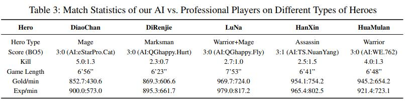

## 

​		2019年12月20号，腾讯AI Lab发布了一篇paper，称他们利用深度强化学习技术训练了出了一个超强AI，该AI能轻松击败顶尖水平的职业选手。在论文的最后贴出了AI与多名职业选手的交战情况：

从上图可知，每位选手使用自己最擅长的英雄与AI进行1V1对战，无一例外都输给了AI，除了TS的Nuan Yang使用韩信拿下了一个AI人头外，其余玩家都没能击杀AI一次。那么腾讯到底是怎样训练自己AI的呢？在发布的这篇paper中介绍了整个训练系统的框架以及算法流程，下面就来关注一下腾讯是如何完成自己超强AI训练的吧。

### （一）知识背景

​		当前使用AI玩对抗性游戏的主要分两种：以星际为首的RTS游戏，和以DOTA为首的MOBA游戏。两种游戏侧重的学习难点不同：对于星际类的游戏来说，单个unit的行为较为简单，主要学习的是如何进行兵力组选择和进攻策略；而对于DOTA类的游戏来说，对于一个英雄的操作来说是相当复杂的（涉及到技能连招，攻击目标选择，走位等等），因此这类游戏主要学习的是单英雄的操控。 		论文中介绍，训练AI的方法同样也是基于actor-critc的神经网络，但在此基础上针对性的做出了一些改进：

1. 利用人类先验知识来减少动作探索空间。
2. 将一个人为操作下的多个子操作独立开来。
3. 设定攻击目标选定网络，用于选定攻击目标。