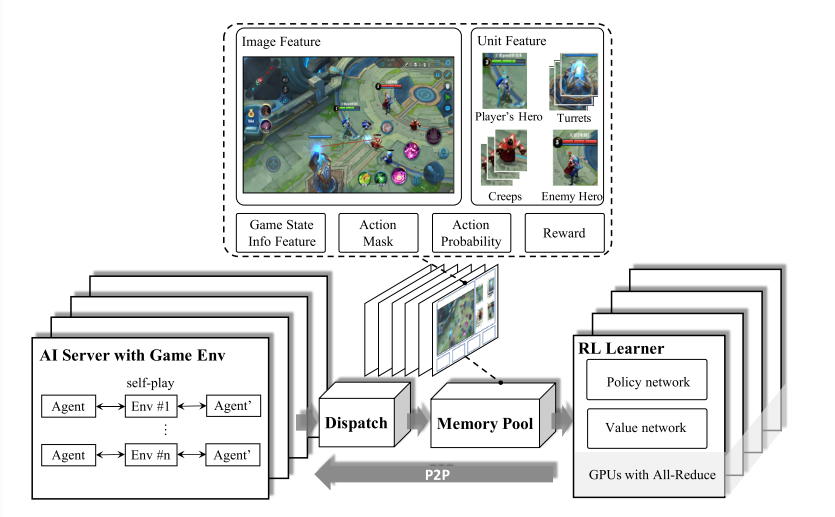
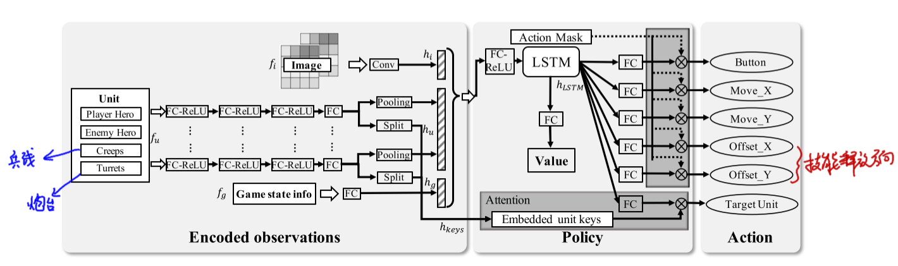
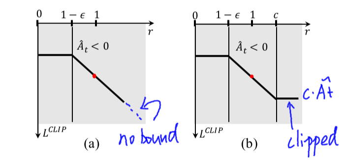

## 利用Deep Reinforcement Learning训练王者荣耀超强AI

​		2019年12月20号，腾讯AI Lab发布了一篇paper，称他们利用深度强化学习技术训练了出了一个超强AI，该AI能轻松击败顶尖水平的职业选手。在论文的最后贴出了AI与多名职业选手的交战情况：

从上图可知，每位选手使用自己最擅长的英雄与AI进行1V1对战，无一例外都输给了AI，除了TS的Nuan Yang使用韩信拿下了一个AI人头外，其余玩家都没能击杀AI一次。那么腾讯到底是怎样训练自己AI的呢？在发布的这篇paper中介绍了整个训练系统的框架以及算法流程，下面就来关注一下腾讯是如何完成自己超强AI训练的吧。

### （一）知识背景

​		当前使用AI玩对抗性游戏的主要分两种：以星际为首的RTS游戏，和以DOTA为首的MOBA游戏。两种游戏侧重的学习难点不同：对于星际类的游戏来说，单个unit的行为较为简单，主要学习的是如何进行兵力组选择和进攻策略；而对于DOTA类的游戏来说，对于一个英雄的操作来说是相当复杂的（涉及到技能连招，攻击目标选择，走位等等），因此这类游戏主要学习的是单英雄的操控。 		论文中介绍，训练AI的方法同样也是基于actor-critc的神经网络，但在此基础上针对性的做出了一些改进：

1. 利用人类先验知识来减少动作探索空间。
2. 将一个人为操作下的多个子操作独立开来。
3. 设定攻击目标选定网络，用于选定攻击目标。
4. 使用改进PPO算法，论文中称为dual-clip PPO。
5. 使用LSTM来学习英雄技能连招的释放。
6. 在系统设计方面，为了快速产生大规模的数据样本，使用多个不同游戏场景同时产生数据并存到Memory Pool中，并使用多个RL学习器并行学习。

在训练完成后，期望训练AI能够完成进攻、诱导、防御、欺骗和技能连招释放的能力。由于游戏中英雄之间技能相差非常大，因此对每个英雄来说都需要训练一个独立的控制AI。对于每一个英雄，AI Lab使用18,000个CPU核以及48张P40显卡（￥14600一张）进行训练学习。每张GPU每秒可训练80000个样本数据，算下来每天训练的数据等于人类500年的学习量。

### （二）系统架构

​		为了加快训练速度，这就需要加大batch size。针对这个问题，AI Lab设计了四个特别的模块，这些模块之间彼此独立：Reinforcement Learning Learner、AI Server、Dispatch Module 和 Memory Pool。 

​		**AI Server** 是为了获取样本数据而设计的模块，在Server中涵盖了AI与环境之间交互的所有逻辑。Server会产生多组episodes，在这些episodes中我方AI使用来自RL Learner的行为策略，而对手的行为则是使用Boltzman 探索算法（一种基于游戏状态特征提取的算法）进行预测。 

​		**Dispatch Module** 的用于对Server 产生的sample数据（回报、特征、行为选择概率等）进行收集，将这些数据进行压缩后存储到Memory Pool中去。一个Dispatch Module可以连接多个AI Server以便于接收多个Server的输出数据以增加Dispatch Moudule的利用率（毕竟压缩加传输速度要远远快于Server生成一个episode的速度）。 

​		**Memory Pool** 主要用于对训练数据的存储。它使用一个循环队列来存储数据，根据数据生成时间进行排序。由于是循环队列模式，因此支持变长样本。 

​		**RL learner** 是一个分布式的训练环境，由于需要大规模的batch size，多个RL learners分别去获取Memory Pool中的样本数据，并将这些Learners捆绑在一起（当成一个大的RL Learner）。那么每个Learner都会得到不同的梯度结果，如何去统一这些梯度结果呢？该论文使用 *ring allreduce algorithm* 对所有梯度值进行平均。将平均后的值当成每一个Leaner的梯度进行计算。

### （三）算法结构

训练AI使用基于actor-critc的神经网络，其输入有3个：游戏画面向量$f_i$，所有种类单位的状态向量集$f_u$和游戏状态向量$f_g$（包括游戏进行时间、炮台数量等游戏环境信息）；输出动作有6个：技能按钮的选择、移动摇杆x偏移、移动摇杆y偏移、技能摇杆x偏移、技能摇杆y偏移和选择哪一个目标对象。论文在普通actor-critic的基础上针对性的做出了一些改进：

1. 设定攻击目标选定网络，用于选定攻击目标。
2. 使用LSTM来学习英雄技能连招的释放。
3. 将一个人为操作下的多个子操作独立开来。
4. 利用人类先验知识（action mask）来减少动作探索空间。
5. 使用改进PPO算法，论文中称为dual-clip PPO。

整个算法结构如下图，下面针对每一个点进行阐述：

#### 3.1 Target Attention

​		为了实现任务目标的选取，算法中构建了一个目标选择模块（target attention）。整个算法流程如上图所示：首先需要提取出图片特征$f_i$、向量特征$f_u$以及游戏状态信息$f_g$，其中$f_i$由卷积层$h_i$提取而得，$f_u$和$f_g$都是由全连接层提取而得。其中，每个unit都有一个$f_u$向量，但由于unit的数量是会变的（比如兵线和炮塔的数量都会随着时间变化），因此通过max-pooling的方法将同一类的unit映射为一个定长向量。此外，每一个$f_u$向量在经过若干层全连接层后都会被拆分成两个输出——一个输出*representation of unit*用于代表该类单位的特征用于后面的action选择，另一个输出*attention keys*将被用于帮助target attention做决策。这里可以理解为：由于Attention模块是直接接收了$f_u$向量作为输入的，因此可认为，在选择哪一个敌方单位作为target的时候，目标选择模块会根据每一类unit的当前状态信息*attention keys*作为参考来进行决策。

#### 3.2 利用LSTM学习技能连招释放

​		当有了每类unit的表征信息*representation of unit*后，我们将所有的表征向量、图片向量$h_u$（$f_u$经过了一个convolution层得到的结果）和游戏状态向量$h_g$（$f_g$经过一个全连接层后得到的结果）全部联合起来，并输入一个LSTM网络，该网络用于5个基本行为决策（包含了如何进行技能连招搭配）：技能按钮的选择、移动摇杆x偏移、移动摇杆y偏移、技能摇杆x偏移、技能摇杆y偏移。由于LSTM具有处理时序信息的能力，因此它能够学会释放技能Button的选择顺序。

#### 3.3 Decoupling of Control Dependencies

​		这个部分主要功能是将一个人为操作分解为若干个独立的子操作。这部分的思想和简单：人为在释放技能的时候不但要选择释放哪一个技能，还需要拖动技能按钮来选择释放方向，这是一个人为操作。但如果把这个人为操作直接当作一个action的话，action space会非常大（技能按钮和方向的组合），因此将一个人为操作分解为多个独立的子行为（技能选择是一个action，释放方向又是另一个独立的action），这样就减少了动作空间。

#### 3.4 Action Mask

​		action mask的引入是为了对动作空间进行剪枝以降低探索收敛的难度。action mask是指利用一些人类的先验知识来告诉AI"不应该"做什么。由于在王者的游戏环境中，动作空间非常巨大，因此探索空间也就很大，这时候加入人为只是的引导就能够使AI在学习的时候进行"有效探索"。举例来说，如果一个AI在靠近野区墙壁的时候，企图探索"往墙壁里面行进"这个行为时，action mask会直接告诉AI这个action是不必要的，一定不会有好的reward效用，因此AI就会放弃这一次的"无用探索"。

#### 3.5 Dual-Clip PPO

​		在传统的PPO算法中，为了避免计算出的修正系数$\frac{\pi_{\theta}(a|s)}{\pi_{{\theta}old}(a|s)}$过大（下面用$r(\theta)$表示修正系数），会进行一个"上限"限定，当超过这个上限就直接被clip掉，公式如下：
$$
L(\theta) = min(r(\theta)\hat{A}_t, clip(r(\theta), 1-\varepsilon, 1+\varepsilon)\hat{A}_t)
$$
这样是work的，但是却忽略了$\hat{A}_t$为负时的情况，由于取得是$min()$，因此若$\hat{A}_t$为负时会变成梯度绝对值越大越被选择，这样就就违背了"梯度上限"的设计初衷。为此，该论文在原本的clip基础上又做了一次负值的下限clip：
$$
L(\theta) = max(\ min(r(\theta)\hat{A}_t,\ clip(r(\theta),\ 1-\varepsilon,\ 1+\varepsilon)\hat{A}_t),\ c\hat{A})
$$
其中，$c$是一个超参数，用于限定clip下限，下图（a）为原本的PPO算法，（b）为dual-PPO算法。

### （四）实验配置

至此，算法和系统部分就介绍完了，最后我们来看一看王者训练模型时的一些参数设置吧：

* $\varepsilon$ in dual-PPO $\rightarrow$ 0.2
* $c$ in dual-PPO $\rightarrow$ 3
* $\gamma$ in actor-critic $\rightarrow$ 0.997
* Learning rate of Adam Optimizer $\rightarrow$ 0.0001
* Using GAE (generalized advantage estimator) to calculate the reward which $\lambda$ $\rightarrow$ 0.95

其中，GAE是一种有效减少梯度估计方差的方法，现在已经被广泛应用在各种策略梯度估计的方法上。以上便是这篇论文介绍的全部内容。

