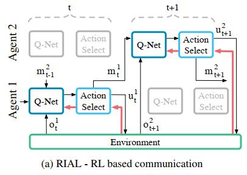

## Learning to Communicate with Deep Multi-Agent Reinforcement Learning

*论文链接：https://papers.nips.cc/paper/6042-learning-to-communicate-with-deep-multi-agent-reinforcement-learning.pdf*

#### 1. 问题提出（解决了什么问题？）

该论文主要解决了在`多智能体`和`每个智能体只能部分观测`情况下，各个智能单位间如何通信的问题。通过强化学习的方式最终使得智能体能够学会如何进行通信（即学出一种通信协议）。最终学习出的协议其实是一个|m|维的向量，添加到Q网络的输入中起到影响决策的作用。

#### 2. 介绍

##### 2.1 论文结构

整个论文分为三个部分：

* **假设出一些需要`通讯`和`多智能体协同`的任务**

假设出的任务必须具备以下3个条件：`需要个体之间配合完成 `、 `个体观测不完整（即单个个体无法感知环境中所有信息）`、`个体决策带有时序性`。所有Agent都有共同的学习目标：采取不同的行为使得一个Reward总值最大化，这个总值是所有Agent`全局共享`的。<br>在学习场景中，每个Agent不仅可以采取一个与环境互动的行为，还可以采取一种”通讯“行为——通过一个有带宽限制的通道告诉其他Agent一些自身观测到的环境信息。由于部分可观测性和通讯受限性，Agent需要学习出一种通讯协议来规划协同他们的自身行为。

* **提出适用于以上场景的几个学习算法 —— RIAL / DIAL**

该论文使用`中心式学习`-`去中心式执行`的方法，即训练过程中各单位之间可以进行无限制通讯，学习完成后最终应用时会受到通讯限制。论文中一共提出了两种approach：

 1-  Reinforced Inter-Agent Learning (RIAL)
```
用一个循环的Deep Q-Learning网络（RNN + DQN）来解决部分可观测问题，其中，RIAL又有2种不同的变种方法:
(a)  每一个agent单独学习一个属于自己的Neural Network，将其余agent看作是环境的一部分。
(b)  只训练一个global的Neural Network，所有agent共享这个网络的参数。
```

 2-  Differentiable Inter-Agent Learning (DIAL)
```
尽管在RIAL的第二种变种方法中，通过参数共享的方式模拟了agent之间的信息共享，但是却没有很好的模拟agent与agent之间"通讯"的过程。DIAL的设计思路中使得在训练过程中，不同agent之间可以传输真正的”梯度消息“，在原文中被称为"real-valued message"。
```

* **分析这些算法是怎样进行通讯协议的学习的**

#### 3. 相关知识背景

阅读本论文需要用到以下几个知识背景：

1. Deep Q-Networks (DQN)
2. Independent DQN
3. Deep Recurrent Q-Networks (该方法很好的解决了多智能体间部分可观测的问题)

#### 4. 论文实验环境设定

论文的环境设定概括为以下几个规则：

1. 在训练过程中，所有agent拥有同一目标：最大化得到的Reward总和值，该总和全局共享。
2. 一个时刻下单个agent可接受到的observation有：
   * 自身对环境的私有观测$o_t^a$ 
3. 一个时刻下单个agent可采取的行为有：
   * 用于与环境交互的行为$u_t^a$，该行为会影响环境并获得一个reward值。
   * 用于通讯的“通讯行为”，该行为可被其他agent观测到，但并不会对环境造成影响，也没有reward值。
4. 学习的通讯协议是一种通过“行为-观测”配对的历史数据映射出来的消息序列。
5. 只有一个agent正确发送了”通讯行为“并且另一个agent正确解析到了这种”通讯行为“才会有一个正向的reward值，这会引起回报稀缺问题（Reward Sparse）。

#### 5. 算法讲解

##### 5.1 Reinforced Inter-Agent Learning (RIAL)

在每一个agent上训练一个DRQN网络，每个agent的Q-network可以表示为
$$
Q^a(o_t^a, m_{t-1}^a, h_{t-1}^a, u^a)
$$
其中：

$o_t^a \qquad \rightarrow \qquad$     agent当前的环境观测

$m_{t-1}^a \qquad \rightarrow \qquad$来自其他agent在上一时刻观测到的消息

$h_{t-1}^a \qquad \rightarrow \qquad$  agent自身的hidden state，hidden state取决于该agent之前遇到的state history

$u^a \qquad \rightarrow \qquad$     当前agent采取的行为u

将整个 $Q$-$Net$ 网络划分为两个$Q$网络 $Q_u$ 和 $Q_m$，u网络是用来评价环境的Q-value，m网络用来评价通信行为的Q-value，也就是说，$Q$-$Net$ 会有两个输出|U|和|M|，动作选择器（Action Select）会根据这两个值分别选择“环境行为”和“通讯行为”。在training过程中，会调整网络参数使得U值最大，然后才是使M值最大，这意味着“环境行为”要比“通讯行为”更值得关注。RIAL整个示意图如下：

<div align=center></div>
图中是两个不同的agent，上层是Agent 2，下层是Agent 1，横轴是时间轴。红色箭头代表计算的梯度信息。Agent 1观测到环境信息$o_t^1$，并接收到来自上一个时刻Agent 2发来的通讯信息$m_{t-1}^2$，以及自身的隐藏状态信息$h_{t-1}^1$，将这3个参数输入到$Q$-$Net$中会得到两个output值|U|和|M|，这两个值输入Action Select模块中选择出两个行为$m_t^1$（通讯行为）和$u_t^1$（环境行为）。注意：通讯行为$m_t^1$是没有reward，也没有梯度信息；只有环境行为$u_t^1$与环境交互之后才能够获取一个来自环境的reward并计算梯度，回传到 $Q$-$Net$ 更新网络参数。<br>因此，在RIAL中，参数更新只是在单agent网络上进行更新，由于$m_t$行为没有reward，梯度无法在多个agent中间传递，所以无法给出agent做出这一次通讯行为后效用评判。RIAL模型更像是在训练agent“我接收到的来自其他agent的通讯信息在我这次决策中所占的比重是多少”。**也就是说，这样的训练模型只能教会agent“信不信”来自其余agent的通讯信息，而无法教会agent在这一时刻应不应该“发送”通讯信息。**

<br>

* 训练所使用的模型

$ Q_u $ 和 $ Q_m $两个模型都使用DQN网络模型，但是做了以下两个变动：

1. **禁用Replay Buffer**。如果使用Replay Buffer会导致模型的不稳定性，这是因为当多个agent同时学习时，经验池中可能会存在“过期样本”。
2. **调整了输入的数据**。传统的DQN要求输入只有环境行为$a$，但为了解决“部分可观测”问题，除了与环境互动的行为$a$外，还额外添加了一个来自其他agent传来的通讯行为$m$。

<br>

* 参数共享的变种方法

RIAL的一种参数共享的变种方法中提到，让所有Agent共享一个神经网络，利用参数共享的方式来加快收敛速度。这种情况下，agent一共需要学习两个Q网络这两个网络的输入一样，只是最后训练的时要拟合的target值不一样。
$$
Q_u（{o_t^a, m_{t-1}^a, h_{t-1}^a, u_{t-1}^a, m_{t-1}^{a'}, a, u_t^a }）
$$

$$
Q_m（{o_t^a, m_{t-1}^a, h_{t-1}^a, u_{t-1}^a, m_{t-1}^{a'}, a, u_t^a }）
$$

`Note`: $a$ 是该agent在所有agent队伍中的索引值（编号）

两个Qfunciton的接收相同的Input值，但在训练的时候一个最大化|U|值，一个最大化|M|值。

<br>

##### 5.2 Differentiable Inter-Agent Learning (DIAL)

在5.1中也提到了，DIAL方法的缺点在于无法在不同agent中**传递梯度**。DIAL方法允许agent在采取一次通讯行为$m_t$之后得到一个回报值，以此来告诉agent这一次采取通讯行为的效用。DIAL将“通讯行为”直接替换成了“把一个agent网络的输出直接传输到另一个agent网络的输入”，这样就为通讯行为建立了一个可以反向传播reward的通道。为了实现这个方法，该方法把原来的$Q$网络改为了一个名叫 $C$-$Net$ 的网络。<br>

C网络接收2个input：

* 来自环境的观测信息$o_t$
* 来自另一个agent传来的通讯消息，该消息是一个**连续型变量**（非离散值，可理解为是一个分布函数）

C网络输出2个output：<br>

* Q(·)，这是state-action的Q值，用于输入action select进行行为的选择。

*  $m_t^a$，这是一个实数向量 (real-value vector)，这个向量不会传入action select模块，而是转换成消息直接传递给下一个agent。怎么转换成消息呢？这个向量从C-Net输出后会经过DRU（discretise/regularise unit，离散合法化单元）进行数据处理，$DRU(m_t^a) = Logistic(N(m_t^a, \sigma))$，其中$\sigma$是这个模型的标准差。这一步的主要作用是将离散的信息向量转换成一个连续的分布。以上是在做中心式学习的时候的步骤，在最终去中心式执行（即模型训练好后要用于实际实验的时候）又需要将连续的分布做离散化处理。

以下是DIAL的数据传输示意图：

<div align=center></div>
图中是两个不同的agent，上层是Agent 2，下层是Agent 1，横轴是时间轴。红色箭头代表计算的梯度信息。可以看到C-Net有两个输出，一个输出Q(·)输出了Action Select模块用于选择环境行为$u_t^1$，与环境互动后会得到一个reward返回给C-Net网络；另一个输出$m_t^1$（离散的实数向量）直接输入到DRU模块进行”离散转连续“变换后（变成了连续型的变量）输入到Agent 2的C-Net中，当Agent 2的C-Net得到了来自环境的回报 $r_{t+1}^2$ 后会回传给C-Net并去计算$m_t^1$的梯度信息，这样就能够将通讯行为所产生的梯度信息回传给Agent 1，用于通讯行为的梯度更新了。

`Note`：为什么要进行DRL（离散转连续）这一步？这是因为，C-Net只能产生离散的向量信息（把输出层的所有神经元的输出值并在一起时一个离散的向量），但是离散的向量是无法进行梯度更新的（离散的数根本无法求导），因此将离散的数字想办法变成一个连续的分布，这样就可以进行梯度更新了。因此，要想建立两个Agent之间C网络的通信信道，并且能够通过计算行为的梯度进行更新，**“离散-连续”转换是非常重要的一步**，**也是该论文的核心创新思想**。

<br>

##### 5.3 Comparation of two methods

在RIAL和DIAL都是基于DQN的Loss来进行通讯行为的学习（环境行为两种方法都一样的），但学习的方式有以下几处不同：

* DIAL中由`接收方`直接传递给`发送方`的误差梯度信息，这样能够更明显的建立“通讯”的行为相关性；而RIAL中没有建立“通讯行为”的“通道”，DQN误差是由“环境行为”和“通讯行为”共同导致的，最终“环境行为”导致的误差也会被看作是“通讯行为”的选择错误，但很有可能此时“通讯行为”并没有任何问题。

* 在RIAL中，直接使用DQN的Loss来进行学习，得到reward始终是一个一维非零的数值；而DIAL中回传的是一个|m|维的梯度信息，多维度比单维度能够包含更多的行为信息，可以学习到的知识更丰富。
* 在DIAL中可以处理连续型action问题，而RIAL只能处理离散型action问题。

<br>

#### 6. 实验 

##### 6.1 实验环境

在论文中使用了一个囚犯通信的场景进行算法实验，场景故事如下：

>  有n个囚犯被关在监狱中，他们每个人都被独立关在自己的小房间内，彼此间不能通信。每天监狱长会挑选其中一个囚犯来到审问室，审问室中只有一盏灯泡，被挑选的囚犯可以选择点亮或熄灭这盏灯泡。此外，在审问室中的囚犯可以拥有一次“猜测”的机会，猜测所有的囚犯都已经来过审问室了，如果发出猜测后确实所有囚犯都来过审问室了，那么所有囚犯被释放；如果猜测是错误的，则所有囚犯被处死。

在这个故事中，在审问室的囚犯拥有观测$o_t^a \in$ { $0, 1$ }，0代表灯是灭的，1代表灯是亮的，其余囚犯没有observation。在审问室的囚犯的环境动作空间$u_t^a \in$ {$"Tell","None"$}，通讯行为$m_t^a \in $ { $0, 1$ }，即打开/关闭灯泡；而其他囚犯的动作空间只有{$"None"$}。通常情况下reward都是0，直到有人发起“猜测”行为，猜对则+1，猜错则-1。

##### 6.2 实验结果

下面是实验结果，其中**n**代表囚犯数。**-NS**代表**不使用参数共享**时的结果，即每个囚犯训练自身单独的网络。**NoComm**代表**不加入通信因素**的结果。

<div align=center></div>

值得注意的是（b）图中的RIAL-NS的方法效果还没有不加入通信协议时好，这充分说明了**要想让每一个agent独立学习一个属于自己的网络模型是相当困难的**。