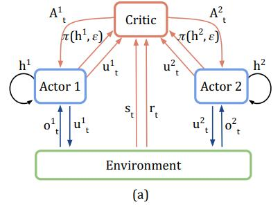
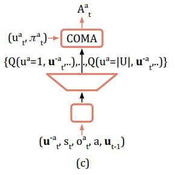
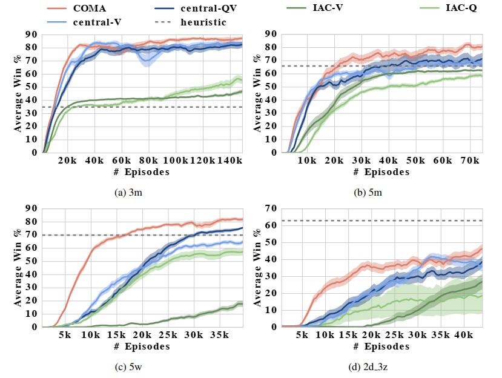

## Counterfactual Multi-Agent Policy Gradients

*论文链接：https://arxiv.org/pdf/1705.08926.pdf*

#### 1. 问题提出（解决了什么问题？）

在现实世界中，有非常多的问题需要多个单位之间的“合作”才能完成任务，这就需要学习一种`非中心式策略`的控制系统，即每个agent有着属于自己的决策大脑，而非靠拥有全局信息的决策系统下达指令（毕竟有时候全局的信息量过于庞大，并且agent到中心网络的通信不一定每时每刻都稳定，因此中心式的决策系统很难实现）。因此，该论文提出了一种方法用于学习`非中心式的`、`部分可观测的`多智能体协同的控制策略。 COMA利用全局评价网络（critic）来评价Q值，利用非全局行为网络（actor）来决定agent的行为。由于在训练时使用的是全局网络进行评价，并且采用参数共享的方式，使得agent能够在做行为选择的时候参考其他agent的状态再做决定，这就加入了“协同”的功能。 论文最后使用星际争霸游戏作为场景验证，并加入了`部分观测`的限制，细节再最后一小节会讲解。

#### 2. 介绍

该论文分为以下三个部分：

* **提出传统的RL算法在协同任务中不足**

若使用传统的RL算法来解决多智能体的问题，则会存在以下三个不足之处：

>1. 输入的action space应该是所有agent的**联合动作空间**（joint action space），这个空间会随着agent数量增加而增加。
>2. 此外，由于部分可观测性（即单个agent在某一时刻只能观测到部分环境的信息，无法获得全局信息，比如一个小兵只能看到视野范围内的地图信息，视野外的地图信息是无法观测的），使得agent在做决策时只能依照自己当前的部分观测信息（local observation），没有与其他agent进行信息共享的能力。
>3. 使用联合动作空间获得的reward是来自所有agent采取的所有action共同得到的reward，这就很难知道每一个agent的action应该得到的多少子回报，这就是原文中提到的 "Individual Reward Assignment"。

* **COMA中的主要思想**

COMA是一种基于actor-critic的变种方法，其中actor是依照critic评估出来的梯度值进行更新学习的。整个算法共有三个比较核心的思想：

>1. 学习过程中会有一个中心式评价网络, 这个网络主要用于对actor选择的决策进行好坏评价以此来教会actor如何做一个好的决策。为什么称为中心式的网络？这是因为该网络可以获取场景中的全局信息，包括所有agent在这一时刻采取的行为信息和观测信息。但是，单个agent在利用actor做行为选择时只能依照自身的当前观测信息和经历过的历史信息进行决策，做决策时是无法获得全局信息的。这种方式被称为“中心式评价，边缘式决策”。
>2. COMA引入了一个概念叫做 "反事实准则(counterfactual baseline)" ，这个概念是整篇论文的重点。为了解决 Individual Reward Assignment 的问题，反事实准则提出，每个agent应该拥有不同的reward，这样才能知道在这一次的全局行为决策中单个agent的action贡献是多少。而单个agent的reward通过两个值计算得来：当前情况下的全局reward和将该agent行为替换为一个'默认行为'后的全局reward。可以这样理解：该回报值其实计算的是Agent $a$采取行为 $u$ 会比采取默认行为 $c_a$ 要更好（$D^a$ > 0）还是更坏（$D^a$ < 0）。这个特定agent下特定动作的reward就被称为counterfactual baseline，COMA使得每一个agent的每一个action都有一个自身的counterfactual baseline。
>3. 如上面所说，每一个agent的每一个动作都会有一个counterfactual baseline，如果要计算出所有动作的baseline，就需要把每一个行为替换成 '默认行为' 并与环境互动得到一个reward。当agent数目很多且联合动作空间很大的时候，这种方法显然是不可取的。因此，COMA提出：使用**中心critic**网络来estimate每一个动作的**Q值**，来**代替**与环境交互后得到的**reward**。

* **验证场景及其结果分析**

#### 3. 背景

论文中将多智能体协同任务想象成一个随机决策的游戏，这个游戏 $G$ 包含以下几个因素：
$$
G = <S, U, P, r, Z, O, n, \gamma>
$$
其中，

* $S \quad \rightarrow \quad$ 环境状态集： $\forall s \in S$.

* $U \quad \rightarrow \quad$ 所有动作样本空间：在每一时刻，每个agent采取一个行为 $u_t^a \in U$，并组成联合动作空间 $\textbf{u} \in U$.

* $P \quad \rightarrow \quad$ 状态转移函数：根据当前状态$s$和联合动作空间$\textbf{u}$，计算一时刻状态$s'$，$P(s'|s, \textbf{u})$.

* $r \quad \rightarrow \quad$ 全局回报值：$r(s, \textbf{u})$.

* $Z \quad \rightarrow \quad$ 局部观测集：单个agent在每一时刻有一个局部观测 $z \in Z$.

* $O \quad \rightarrow \quad$ 局部观测函数：Agent $a$ 的局部观测 $z$ 是根据全局环境信息 $s$ 通过 $O$ 函数计算得来，$z = O(s, a)$.

* $n \quad \rightarrow \quad$ agent的个数，共有 $n$ 个.

* $\gamma \quad \rightarrow \quad$ 折扣因子，用于指定计算未来回报时的衰减强弱.

此外，每个agent有一个 action-observation 的历史记录 $\tau^a$，actor在做决策的时候是基于历史信息做的决策 $\pi^a(u^a|\tau^a)$. 其实这里基于历史记录做决策可以理解为：之前在做update决策网络参数的时候，是基于之前的历史信息做的更新，所以用更新后的actor去做决策就可以看作是记住了历史经验后做的决策了。 

这里在回顾一下DQN中的一些基本概念，后续内容会用的到： 

**累计回报**： $R_t = \sum_{l=0}^\infty{\gamma^lr_{t+l}}$，其中 $\gamma$ 是折扣因子； **评价函数**分为两个：对当前状态的评价函数 $V^\pi(s_t)$，对当前状态下当前联合动作空间的评价函数 $Q^\pi(s_t, u_t)$;
$$
V^\pi(s_t) = E[R_t|s_t] \qquad Q^\pi(s_t, \textbf{u}_t) = E[R_t|s_t, \textbf{u}_t]
$$
**优势函数**： $A^\pi(s_t, \textbf{u}_t) = Q^\pi(s_t, \textbf{u}_t) - V^\pi(s_t)$.

**Policy Gradient** ：Value-Based中主要使用的更新方法——梯度上升法，梯度 $g$ 可以表示为：
$$
g = \sum_{t=0}^TR_t\bigtriangledown_{\theta^\pi}log\pi(u_t|s_t)
$$

**关于Actor-Critic**模型：

AC模型中，actor是根据critic所求得的梯度来进行学习的。因为$R_t$是一个期望值，无法求得精确的值，因此需要用其他的表达式来近似替代$R_t$，共有两种方法：

> **优势函数法**：使用 $Q(s_t, u_t) - b(s_t)$ 来代替 $R_t$，其中 $b$ 为一个基准值，用于保证所有action的Q值有正有负，通常可以用 $V(s_t)$ 来代替 $b$ 值。也就是用 $Q^\pi(s_t, u_t) - V^\pi(s_t) = A(s_t, u_t)$ 来代替 $R_t$。
>
> **TD-Error法**：使用 $r_t + \gamma V(s_{t+1}) - V(s_t)$ 来代替 $R_t$ 。 

**训练中心评价网络critic**：

在这篇论文中，作者训练了一个中心评价网络$f^c(·, \theta^c)$，网络参数为 $\theta^c$，使用一种变种的TD-Error法进行学习——$TD(\lambda)$： 将$n$ 步的reward值进行综合来得到一个平均值 $G_t^{(n)} = \sum_{l=1}^n\gamma^{l-1}r_{t+l} + \gamma^nf^c(·_{t+n}, \theta^c)$。使用梯度下降的方法来更新网络参数$\theta^c$，$L_t$表示$t$时刻的损失函数:
$$
L_t(\theta^c) = (y^{(\lambda)} - f^c(_{·t}, \theta^c)) ^ 2
$$
其中： 
$$
\begin{align}
y^{(\lambda)} &= (1-\lambda)\sum_{n=1}^\infty \lambda^{n-1}G_t^{(n)} \\

G_t^{(n)} &= \sum_{l=1}^n\gamma^{l-1}r_{t+l} + \gamma^nf^c(·_{t+n}, \theta^c)
\end{align}
$$

因此，整个公式也可以表示为： 
$$
L_t(\theta^c) = ((1-\lambda)\sum_{n=1}^\infty \lambda^{n-1}(\sum_{l=1}^n\gamma^{l-1}r_{t+l} + \gamma^n {\color{red}f^c(·_{t+n}, \theta^c)}) - f^c(·_{t}, \theta^c)) ^ 2
$$

`Note`：公式中一共有两个 $f^c(·, \theta^c)$ 网络，但是前一个$f^c()$是estimate出来的目标值 $y^{(\lambda)}$，为了加快模型的收敛速度，第一个的 $f^c()$ 中的$\theta^c$ 应该被**fix**住（式子中的红色部分），若干个steps后再被update，这和target network的思路是一样的。

#### 4. 算法分析

##### 4.1 Independent Actor-Critic

IAC方法指每一个agent学习一个独立的actor-critic，在这篇论文中采用参数共享的方法，使得所有agent共用一个actor和一个critic。在学习的时候，critic只能根据agent自身的local observation进行估计值，并且也只能估计该agent的单个动作$u^a$的效用，而不是联合动作空间$\textbf{u}$的效用。 论文中对传统的IAC算法有两处改变:

1. 在估计V值时，每个 agent 的 critic 估计的是$V(\tau^a)$，估计的是这个agent历史action-observation数据的效用值，而不是传统的当前状态的效用值$V(s_t)$。$V$评价网络基于$TD(\lambda)$方法进行梯度更新，见上面。
2. 在估计Q值时，每个agent的critic估计的是$Q(\tau^a, u^a)$, 也是基于action-observation的历史数据对当前行为$u^a$进行效用估计。$Q$评价网络利用优势函数$A(\tau^a, u^a)$来代替 $r_t^a$ 进行学习，其中优势函数的定义为：单个动作产生的Q值减去所有动作产生的Q值，即 $A(\tau^a, u^a) = Q(\tau^a, u^a) - V(\tau^a)$。其中$V(\tau^a)$定义为：在已知"动作-观测"历史数据下，所有动作产生的效用总和，即$V(\tau^a) = \sum_{u^a}\pi(u^a|\tau^a)Q(\tau^a, u^a)$。

IAC的缺陷在于，训练时只能依据单个agent的局部观测和单个action的效用评定，这样很难学出一套好的协同策略。

##### 4.2 Counterfatual Multi-Agent Policy Gradient

COMA的主要思想有三个：中心式评价网络，使用反事实准为每一个行为分配不同的reward值，高效计算每一个不同的reward值，下面对每一个思想进行介绍讲解。

* **Center critic**

在IAC算法中，训练评价网络时只用到了单个agent的history $\tau^a$。既然这个评价网络只会在训练的时候使用，那么我们完全可以把全局状态 $s$ 输入用于训练，若全局观测不可获得，则将当前所有agent的"action-observation"的历史记录 $\tau$代替全局状态 $s$，如下图所示:

图中，每一个Actor都会给出此刻的决策行为 $u_t$，并且环境也会给出此时环境的全局信息 $s_t$ 以及此刻的回报值 $r_t$。 

一种很简单的方式是直接使用TD-Error来进化这个网络：
$$
g = \bigtriangledown_{\theta_\pi}log\pi(u|\tau_t^a)(r+\gamma V(s_{t+1}) - V(s_t))
$$
但是，这样的方法不能解决 Individual Reward Assignment 的问题，因为TD算出来的Reward是一个全局Reward ，无法推算出每一个action的单独Reward值。为此，论文提出了"反事实准则"。

* **Counterfatual baseline**

反事实准则（Conuterfatual Baseline）允许为不同的action独立分配一个不同的独立reward。这个独立reward $D^a$ 需要根据`当前情况下的全局reward`和`将该agent行为替换为一个'默认行为'后的全局reward`两个值进行计算，
$$
D^a = r(s, \textbf{u}) - r(s, (\textbf{u}^{-a}, c_a))
$$
其中，$\textbf{u}^{-a}$ 代表联合动作空间除去当前Agent $a$ 这一时刻采取的行为。$(\textbf{u}^{-a}, c_a)$ 代表当前Agent $a$ 采取"默认行为" $c_a$ 后所有Agent的联合动作空间。在学习过程中，agent会想办法最大化回报值 $D^a$，这其实就是在想办法最大化全局的reward $r(s, \textbf{u})$，因为式子的后项跟agent当前采取什么行为是没有关系的。关于$D^a$这个式子可以这样理解：**回报值$D^a$其实计算的是Agent $a$采取行为 $u$ 会比采取默认行为 $c_a$ 要更好（$D^a$ > 0）还是更坏（$D^a$ < 0）**。 这个想法是正确的，但是要想计算出每一个动作的$D^a$值，就需要将每个动作都替换成默认行为$c_a$去与环境互动一次得到最终结果，这样采样次数会非常多；此外，默认行为的选取也是无法预测的，到底选择哪一个行为当作默认行为才是最合适的也是比较难决定的。因此，文中提出使用"函数拟合"的方式来计算$D^a$。

前面提到，中心评价网络可以评价一个联合动作空间 $\textbf{u}$ 在一个状态 $s$ 下的 $Q$ 值。由于默认行为很难定义，于是我们把**采取 "默认行为" 得到的效用值近似为采取一个Agent "所有可能行为" 的效用值总和**。因此，$D^a$ 就可以用以下等式进行计算：
$$
A^a(s, \textbf{u}) = Q(s, \textbf{u}) - \sum_{u_a'}\pi^a(u'^a|\tau^a)Q(s, (\textbf{u}^{-a}, u'^a))
$$
其中，$A^a(s, \textbf{u})$ 就是 $D^a$ 的等效近似。

* **Efficient evaluation of baseline**

尽管baseline的方式解决了独立回报的问题，但是如果要建立一个网络，接收$s, \textbf{u}$两个输入，输出为所有agent的所有action的话，那么输出神经元的个数就等于 $|U|^n$（n个agent有|U|个动作）。当agent数目很多或动作空间很大的时候就会造成输出层无法实现。为此，COMA构造了一种网络，该网络接收 $\textbf{u}^{-a}_t, s_t, o_t^a, a, \textbf{u}^{-a}_{t-1}$ 等参数，输出为Agent $a$ 每一个action的Q-value值，输出维度由 $|U|^n$ 降到了 $|U|$ ，如下图所示。 

#### 5. 实验

##### 5.1 实验场景

该论文使用星际争霸游戏作为实验场景，让算法控制的小队和游戏AI控制的小队进行对战，并计算胜率。算法小队中，每一个作战单位都由一个去中心式的controller进行控制。为了提升游戏难度，比赛加入了 "部分可观测" 条件的限制，视野范围等于攻击范围。这意味着当敌人没有进入攻击范围内时，作战单位是不知道敌人位置信息的，因此agent不仅要学会如何去探索敌方目标，还需要与队友共享敌方目标的位置信息。为了证明加入 "部分可观测" 限制后问题变得有多复杂，作者做了实验对比：当不加入观测限制时，普通的启发式算法能够到达98%的胜率；加入限制后，胜率降到了66%。 

##### 5.2 动作空间及回报值

每个agent都有着相同的动作空间：{ move[direction]，attack[enemy_id]，stop，noop }。 一次Episode下的全局Reward为：对敌人造成的伤害 $D_e$ 减去我方受到的伤害 $D_u$ 除以2，此外，若击毁一个敌方单位获得10点的回报，即： 
$$
R(t) = D_e - \frac{D_u}{2} + 10n
$$
其中，$n$为摧毁敌方单位数。若有一方将敌方团灭，则获得的回报值为全队剩余血量+200。 

##### 5.3 状态特征

算法一共有两个网络：actor 和 critic。其中actor接收agent的局部观测信息；critic接收全局状态信息。 

* 局部观测信息

由于作战单位的视野范围等于攻击范围，因此观测到的视野是以该单位为中心的一个圆。局部观测信息是指在视野圆圈内，**每一个单位**（包括敌方和友方）的以下几个信息：**distance，relative x，relative y，unit type，shield**。其中 unit type 是指作战单位是何种兵种，shield是为了模拟平A的冷却（因为t切割的很小，每一时刻Agent都有可能选择平A这个动作，所以在平A还没有冷却好的时候，敌方单位会套上一个无敌的盾来抵消这一次平A受到的伤害）。 *疑问：观测范围中的单位数量应该是随时间变化而变化的，但网络的输入层神经元应该是固定的，怎么解决变长的问题？(未解决)* 

* 全局观测信息

全局观测信息包含了所有单位的**relative x，relative y，unit type，shield，healthy point，cooldown**信息，其中 relative 的坐标信息是相对据地图中心的相对坐标，不再是针对于某一个特定目标的坐标。 

1. 喂给**独立回报计算网络**（Q-function critic，用于计算单个动作独立回报）的数据包括**全局观测信息** + **被评估agent此刻局部观测信息**。
2. 喂给**中心评价网络**（center critic，用于评估全局状态$V(s_t)$）的数据包括**全局观测信息** + **全部agent此刻局部观测信息**。

##### 5.4 实验结果

实验结果如下图所示，其中3m，5m分别指代一个作战小队中包含3个，5个marine（一种兵种）；2d_3z指代一个作战小队中包含2条龙和3个狂热者。

