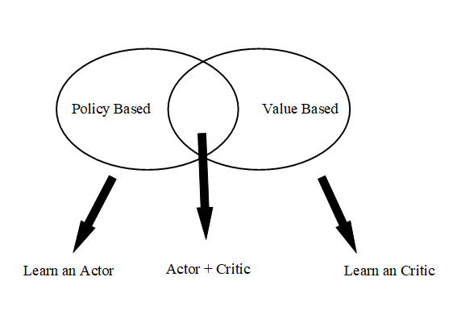
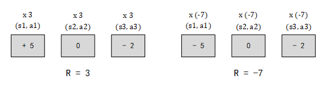
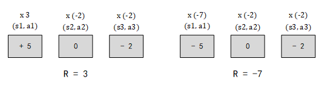

## Notes In Deep Reinforcement Learning 
---

### Concepts in Reinforcement Learning
1. The main goal of Reinforcement Learning is to maximum the `Total Reward`.
2. `Total Reward` is the sum of all reward in `One Eposide`, so the model doesn't know which steps in this eposide are good and which are bad.
3. Only few actions can get the positive reward (ex: fire and killing the enemy in Space War game gets positive reward but moving gets no reward), so how to let the model find these right actions is very important.

### Difficulties in RL
1. Reward Delay
   * Only "Fire" can obtain rewards, but moving before fire is also important (moving has no reward), how to let the model learn to move properly?
   * In chess game, it may be better to sacrifice immediate reward to gain more long-term reward.
2. Agent's actions may affect the environment
   * How to explore the world (`observation`) as more as possible.
   * How to explore the `action-combination` as more as possible.

### A3C Method - Asynchronous Advantage Actor-Critic
The A3C method is the most popular model which combines policy-based method and value-based method, the structure is shown as below. To learn A3C model, we need to know the concepts of `policy-based` and `value-based`.

### Policy-based Approach - Learn an Actor (Policy Gradient Method)
This approach try to learn a policy(also called actor). It accepts the observation as input, and output an action. The policy(actor) can be any model. If you $use$ an Neural Network to as your actor, then you are doing Deep Reinforcement Learning.

$$
Input(Observation) \rightarrow Actor/Policy \rightarrow Output(Action)
$$

There are **three steps** to build DRL:
##### 1. Decide Function of Actor Model (NN? ...)

Here we use the NN as our Actor, so:
* The Input of this NN is the observation of machine represented as Vector or Matrix. (Ex: Image Pixels to Matrix)
* The Output of this NN is Action `Probability`. The most important point is that we shouldn't always choose the action which has the highest probability, it should be a stochastic decisions according to the probability distribution.
* The Advantage of NN to Q-table is: we can't enumerate all observations (such as we can't list all pixels' combinations of a game) in some complex scenes, then we can use Neural Network to promise that we can always obtain an output even if this observation didn't appear in the previous train set.

##### 2. Decide Goodness of this Function
Since we use the Neural Network as our function model, we need to decide what is the goodness of this model (a standard to judge the performance of current model). We use $\overline{R(\theta)}$ to express this standard, which $\theta$ is the parameters of current model.

* Given an actor $\pi_\theta(t)$ with Network-Parameters $\theta$, $t$ is the observation (input).
* Use the actor $\pi_\theta(t)$ to play the video game until this game finished.
* Sum all rewards in this eposide and marked as $R(\theta) \rightarrow R(\theta) = \sum_{t=1}^Tr_t$.
`Note`: $R(\theta)$ is a variable, cause even if we use the same actor $\pi_\theta(t)$ to play the same game many times, we can get the different $R(\theta)$ (*random mechanism in game and action chosen*). So we want to maximum the $\overline{R(\theta)}$ which expresses the expect of $R(\theta)$.
* Use the $\overline{R(\theta)}$ to expresses the goodness of $\pi_\theta(t)$.

*How to Calculate the $R(\theta)$?*

* An eposide is considered as a trajectory $\tau$
  * $\tau$ = {$s_1, a_1, r_1, s_2, a_2, r_2, ..., s_T, a_T, r_T$} $\rightarrow$ *all the history in this eposide*
  * $R(\tau) = \sum_{t=1}^Tr_t$

* Different $\tau$ has different probability to appear, the probability of $\tau$ is depending on the parameter $\theta$ of actor $\pi_\theta(t)$. So we define the probability of $\tau$ as $P(\tau|\theta)$.
$$
\overline{R(\theta)} = \sum_\tau{P(\tau|\theta)R(\tau)}
$$

* We use actor $\pi_\theta(t)$ to play N times game, obtain the list {$\tau^1, \tau^2, ..., \tau^N$}. Each $\tau^n$ has a reward $R(\tau^n)$, the mean of these $R(\tau^n)$ approximate equals to the expect $\overline{R(\theta)}$.
$$
\overline{R(\theta)} \approx \frac{1}{N}\sum_{n=1}^NR(\tau^n)
$$

##### 3. Choose the best function
Now we need to know how to calculate the $\theta$, here we use the `Gradient Ascend` method.

* problem statements:
$$
\theta^* = argmax_\theta\overline{R(\theta)} \rightarrow \overline{R(\theta)} = \sum_{\tau}P(\tau|\theta)R(\tau)
$$
* gradient ascent:
  * Start with $\theta^0$.
  * $\theta^1 = \theta^0 + \eta\bigtriangledown{\overline{R(\theta^0)}}$
  * $\theta^2 = \theta^1 + \eta\bigtriangledown{\overline{R(\theta^1)}}$
  *  ...
* The $\theta$ includes the parameters in the current Neural Network, $\theta = $ {$w_1, w_2, w_3, ..., b_1, b_2, b_3, ...$}, which the $\bigtriangledown R(\theta) = \left[ \begin{matrix} \frac{\partial{R(\theta)}}{\partial{w_1}} \\ \frac{\partial{R(\theta)}}{\partial{w_2}} \\ ... \\ \frac{\partial{R(\theta)}}{\partial{b_1}} \\ \frac{\partial{R(\theta)}}{\partial{b_2}} \\ ... \end{matrix} \right]$.
  

It's time to calculate the gradient of $R(\theta) = \sum_{\tau}P(\tau|\theta)R(\tau)$, since $R(\tau)$ has nothing to do with $\theta$, the gradient can be expressed as:

$$
\bigtriangledown{R(\theta)} = \sum_\tau{R(\tau)\bigtriangledown{P(\tau|\theta)}} = \sum_\tau{R(\tau)P(\tau|\theta)\frac{\bigtriangledown{P(\tau|\theta)}}{P(\tau|\theta)}} = \sum_\tau{R(\tau)P(\tau|\theta)\bigtriangledown{logP(\tau|\theta)}}
$$

`Note`: $\frac{dlog(f(x))}{dx} = \frac{1}{f(x)}\frac{df(x)}{dx}$

Use $\theta$ policy play the game N times, obtain {$\tau_1, \tau_2, \tau_3, ...$}:
$$
\bigtriangledown{R(\theta)} \approx \frac{1}{N}\sum_{n=1}^N{R(\tau^n)\bigtriangledown{logP(\tau|\theta)}}
$$

*How to Calculate the $\bigtriangledown{logP(\tau|\theta)}$?*

Since $\tau$ is the history of one eposide, so: 
$$
\begin{align*}
P(\tau|\theta) &= P(s_1)P(a_1|s_1, \theta)P(r_1, s_2|s_1, a_1)P(a_2|s_2, \theta)... \\
&= P(s_1)\prod_{t=1}^T{P(a_t|s_t, \theta)P(r_t, s_{t+1}|s_t, a_t)}logP(\tau|\theta) \\
&= logP(s_1) + \sum_{t=1}^T{logP(a_t|s_t, \theta) + logP(r_t, s_{t+1}|s_t, a_t)}
\end{align*}
$$

Ignore the terms which not related to $\theta$:

$$
\bigtriangledown{logP(\tau|\theta)} = \sum_{t=1}^T{\bigtriangledown{logP(a_t|s_t, \theta)}}
$$

So the final result of $\bigtriangledown\overline{R(\theta)}$ is :

$$
\bigtriangledown\overline{R(\theta)} = \frac{1}{N}\sum_{n=1}^N\sum_{t=1}^T{R(\tau^n)\bigtriangledown{logP(a_t^n|s_t^n, \theta)}}
$$

The meaning of this equation is very clear:
* if $R(\tau^n)$ is positive $\rightarrow$ tune $\theta$ to increase the $P(a_t^n|s_t^n)$.
* if $R(\tau^n)$ is negative $\rightarrow$ tune $\theta$ to decrease the $P(a_t^n|s_t^n)$

Use this method can resolve the [Reward Delay Problem](#Difficulties in RL) in **Difficulties in RL** chapter, because here we use the `cumulative reward` of one entire eposide $R(\tau^n)$, not just the immediate reward after taking one action.

*Add a Baseline - b* 
To avoid all of $R(\tau^n)$ is positive (*there should be some negative reward to tell model don't take this action at this state*), we can add a baseline. So the equation changes to:
$$
\bigtriangledown\overline{R(\theta)} = \frac{1}{N}\sum_{n=1}^N\sum_{t=1}^T{(R(\tau^n) - b)\bigtriangledown{logP(a_t^n|s_t^n, \theta)}}
$$

*Assign Suitable Weight of each Action* 

Use the total reward $R(\tau)$ to tune the all actions' probability in this eposide also has some disadvantage, show as below:

The left picture show one eposide whose total reward R is 5, so the probabilities of all actions in this eposide will be increased (such as x5), but the main positive reward obtained from the $a_1$, while $a_2$ and $a_3$ didn't give any positive reward, but the probability of $a_2$ and $a_3$ also be increased in this example. Same as right picture, $a_1$ is a bad action, but $a_2$ may not be a bad action, so probability of $a_2$ shouldn't be decreased.

To avoid this problem, we assign different $R$ to each $a_t$, the $R$ is the cumulation of $r_t$ which is the sum of all rewards obtained after $a_t$, now the equation becomes:

$$
\bigtriangledown\overline{R(\theta)} = \frac{1}{N}\sum_{n=1}^N\sum_{t=1}^T{(\sum_{t'=t}^T{\gamma^{t' -t}r_{t'}^n} - b)\bigtriangledown{logP(a_t^n|s_t^n, \theta)}}
$$

`Note`: $\gamma$ called discount factor, $\gamma < 1$.

We can use $A^\theta(s_t, a_t)$ to express the $(\sum_{t'=t}^T{\gamma^{t' -t}r_{t'}^n} - b)$ in above equation, which called `Advantage Function`. This function evaluate how good it is if we take $a_t$ at this state $s_t$ rather than other actions.  

#### On-Policy v.s. Off-Policy

On-Policy and Off-Policy are two different modes of learning:
  * On-Policy: The agent learn the rules by `interacting` with environment. (*learn from itself*)
  * Off-Policy: The agent learn the rules by `watching` others' interacting with environment. (*learn from others*)

Our Policy Gradient Method is an On-Policy learning mode, so why we need Off-Policy mode? This is because we use sampling N times and get the mean value to approximate the expect $\overline{R(\theta)} = \sum_\tau{P(\tau|\theta)R(\tau)}$. But when we update the $\theta$, the $P(\tau|\theta)$ changed, so we need to do N sampling again and get the mean value. This will take a lot of time to do sampling after we update $\theta$. The resolution is, we build a model $\pi_\theta$, this model accept the training data from the other model $\pi_{\theta'}$. Use $\pi_{\theta'}$ to collect data, and train the $\theta$ with $\theta'$, since don't change $\theta'$, the sampling data can be reused. 

#### Importance Sampling (On-Policy $\rightarrow$ Off-Policy)

Importance Sampling is a method to get the expect of one function $E_{x\sim{p}}(p(x))$ by sampling another function $q(x)$. Since we have already known:

$$
E_{x\sim{p}}[f(x)] \approx \frac{1}{N}\sum_{i=1}^N{f(x^i)}
$$

But if we only have {$x^i$} sampled from $q(x)$, how to use this samples to calculate the $E[p(x)]$? We can change equation above:

$$
E_{x\sim{p}}[f(x)] = \int{p(x)f(x)}dx = \int{f(x)\frac{p(x)}{q(x)}q(x)}dx = E_{x\sim{q}}[f(x)\frac{p(x)}{q(x)}]
$$

That means we can get the expect of distribution $p(x)$ by sampling the {$x^i$} from another distribution $q(x)$, only need to do some rectification, $\frac{p(x)}{q(x)}$ called rectification term. Now we can consider our $\pi_\theta$ model as $p(x)$, the $\pi_{\theta'}$ as $q(x)$, use the $q(x)$ to sample data to tune $p(x)$. 

$$
\bigtriangledown{\overline{R(\theta)}} = E_{\tau\sim{p_\theta(\tau)}}[R(\tau)\bigtriangledown{logp_\theta(\tau)}] = E_{\tau\sim{p_{\theta'(\tau)}}}[\frac{p_\theta(\tau)}{p_{\theta'}(\tau)}R(\tau)\bigtriangledown{logp_\theta(\tau)}]
$$

then we can use $\theta'$ to sample many times and train $\theta$ many times. After many iterations, we update $\theta'$. Continue to transform the equation:

$$
E_{(s_t, a_t)\sim{\pi_\theta}}[A^{\theta}(s_t, a_t)\bigtriangledown{logp_\theta(a_t^n|s_t^n)}] = E_{(s_t, a_t)\sim{\pi_{\theta'}}}[\frac{P_\theta(s_t, a_t)}{P_{\theta'}(s_t, a_t)}A^{\theta'}(s_t, a_t)\bigtriangledown{logp_\theta(a_t^n|s_t^n)}]
$$

Let the $P_{\theta'}(s_t, a_t) = P_{\theta'}(a_t|s_t)P_{\theta'}(s_t)$, and $P_{\theta}(s_t, a_t) = P_{\theta}(a_t|s_t)P_{\theta}(s_t)$. We consider the environment observation $s$ is not related to actor $\theta$ (*ignore the environment changing by action*), then $P_{\theta}(s_t) = P_{\theta'}(s_t)$, equation becomes:

$$
E_{(s_t, a_t)\sim{\pi_{\theta'}}}[\frac{P_{\theta}(a_t|s_t)}{P_{\theta'}(a_t|s_t)}A^{\theta'}(s_t, a_t)\bigtriangledown{logp_\theta(a_t^n|s_t^n)}]
$$

Here defines:

$$
J^{\theta'}(\theta) = E_{(s_t, a_t)\sim{\pi_{\theta'}}}[\frac{P_\theta(a_t|s_t)}{P_{\theta'}(a_t|s_t)}A^{\theta'}(s_t, a_t)]
$$

`Note`: Since we use $\theta'$ to sample data for $\theta$, the distribution of $\theta$ can't be very different from $\theta'$, how to determine the difference between two distribution and end the model training if $\theta'$ is distinct from $\theta$? Now let's start to learn PPO Algorithm. 

### Value-based Approach - Learn an Critic

A critic doesn't choose an action (*it's different from actor*), it `evaluates the performance` of a given actor. So an actor can be found from a critic.