## Recurrent Neural Network

#### Feature of RNN

Differ from normal Neural Network, Recurrent Neural Network has memory. RNN can remember the history, named *hidden state*, and combine it with current state to choose the action $a$. 

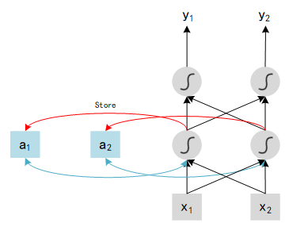

Show as above, $x_1$ and $x_2$ are tow inputs, outputs of each hidden layer will be stored in the Network after be calculated. In the next iteration, with another two inputs $x_1'$ and  $x_2'$ ,  network will combine this new inputs {$x_1' $, $x_2'$ } with last outputs history {$a_1$ , $a_2$ }, and compute the final value $y$. In particular, $a_1$ and $a_2$ are history data, could be explained as memory, so we can say that RNN has ability to remember history states. Here is an example to understand the RNN: assume all weights in network is 1, no bias and all activation functions are linear. We input a sequence : [1, 1], [1, 1], [2, 2], ... and see the result of output. 

* At first we need to initialize the value of memory block, here we set 0 for all block. With [1, 1] input, hidden layer 1 will compute : $x_1$ (1) + $x_2$ (1) + $a_1$ (0) = 2. Same as other neural: 

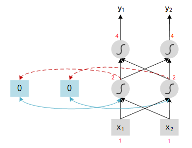

* When the first iteration finished, memory block will update its value to the output of hidden neural. Now we input the second tuple in the sequence : [1, 1], the output should be :  $x_1$ (1) + $x_2$ (1) + $a_1$ (2) = 4.

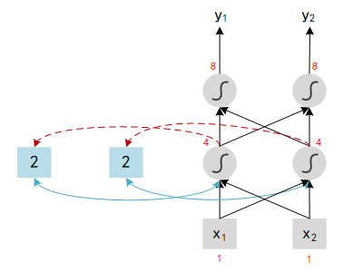

`Note` : Change the sequence order will change the output. 

So the total work flow of RNN looks like:

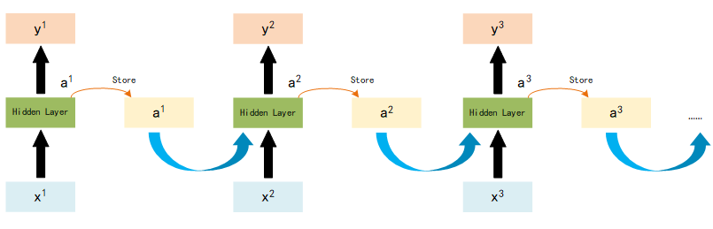

 

#### Different forms of RNN

RNN has a lot of different types, here introduce three of most common methods: Elman Network,  Jordan Network and Bidirectional RNN.

##### Elman Network and Jordan Network

 
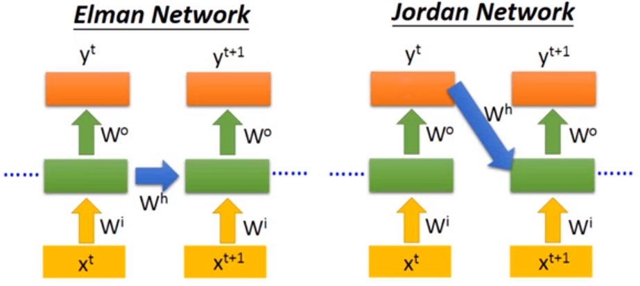

The main difference of these two method is : Elman Network stores all parameters of *hidden layers*, use last parameters to compute the value; Jordan Network stores the *target output* value, and combined this output with next input to compute the value.

##### Bidirectional RNN

Bidirectional RNN is train both Forward and Backward model, use the combination of both model to decide the result of $x^t$, shown as below :

 
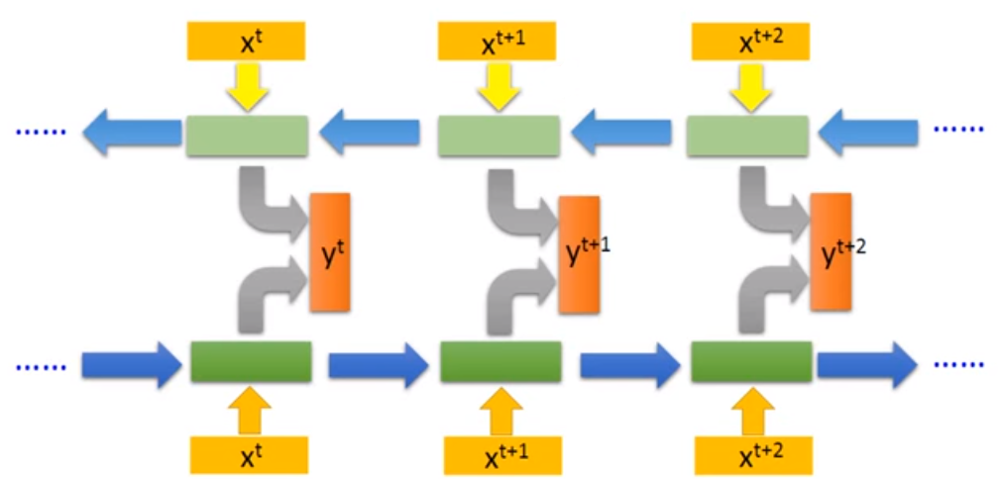

The advantage of this model is that it will decide the value of $x^t$ according to the **entire state** not only the history state (in forward rnn, value of $x^t$ is only decided by the state history before $t$ while there exists backward model in bidirectional rnn which can consider the history between $t$ to $N$, $N$ is the final state of this sequence).

##### ★ Long Short-term Memory (LSTM)

LSTM focus on the structure of Memory cell, which contains three parts in the controller of memory cell: Input Gate, Output Gate and Forget Gate.  

* **Input Gate**: memory cell stores the parameters to remember the history, Input Gate decides if these parameters update or not in each step. New parameters of current step can pass into memory cell only if Input Gate is open while the state of Input Gate is controlled by Control Signal.  

* **Output Gate**: output of this model is the parameters in the memory cell, Output Gate which controlled by Output Gate Signal decides these parameters can output or not.
* **Forget Gate**: memory cell stores a lot of history states, which means there may exist some old and outdated data. Forget Gate controlled by Forget Gate Signal decides which data need to be forgot.

There are 4 inputs (Input Gate Signal, Output Gate Signal, Forget Gate Signal and Input Data) and 1 output in this model, structure shown as below:

 
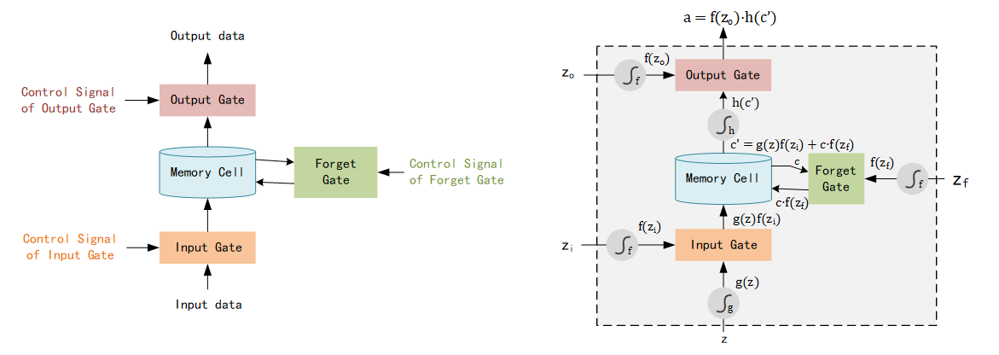

Here we input data as $z$, pass the activate function $g$ and become $g(z)$. Input Gate Signal $z_i$ pass the activate function $f$ and become $f(z_i)$, output of Input Gate is $f(z_i)·g(z)$. $c$ is the origin parameters stored in Memory Cell, $z_f$ is the Forget Gate Signal and the output of Forget Gate is $f(z_f)·c$, which named $c'$. The final output $a$ equals $f(z_0)·h(c')$. 

> **Note**: Activation Function $f$ often be *sigmoid function*, output is 0 or 1, which expresses the Gate is opened or not. For Input Gate, If value equals 1, the input $z$ is fully passed through this gate while if value equals 0, none of input $z$ could be passed.

A clear example could be found [here (29:50)](https://www.youtube.com/watch?v=xCGidAeyS4M) :

 
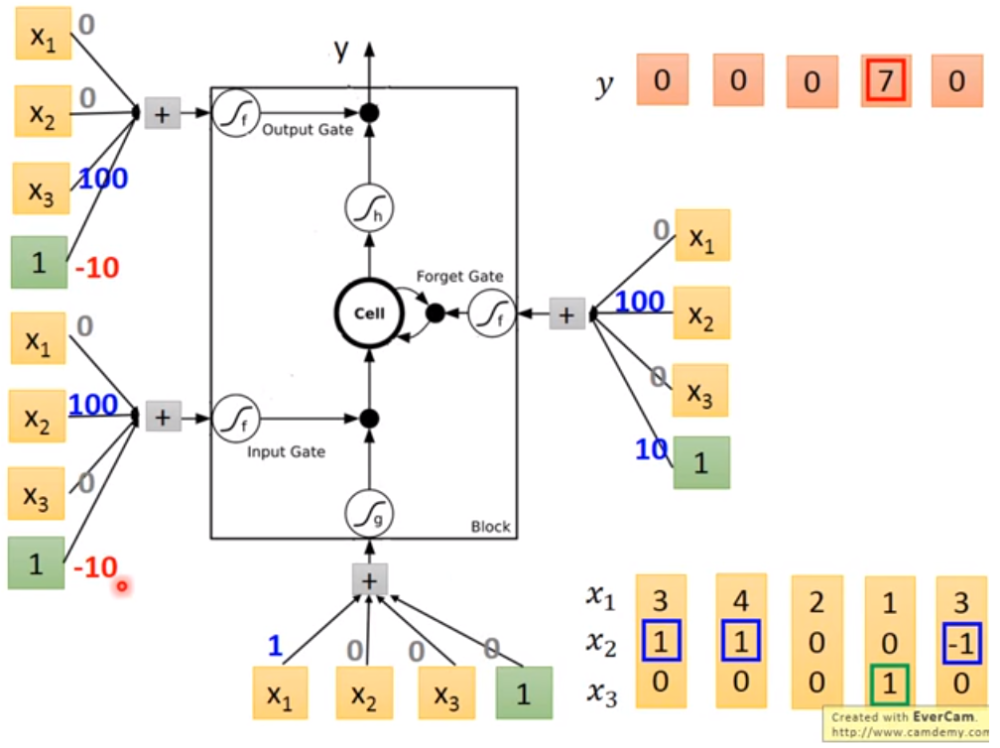

Now we know the structure of Memory Cell. In LSTM, each Memory Cell expresses a neural which means each neural needs 4 different inputs. Typically we have only 1 input, but these 4 inputs are all computed from that 1 input ( by multiple different vector ).

 
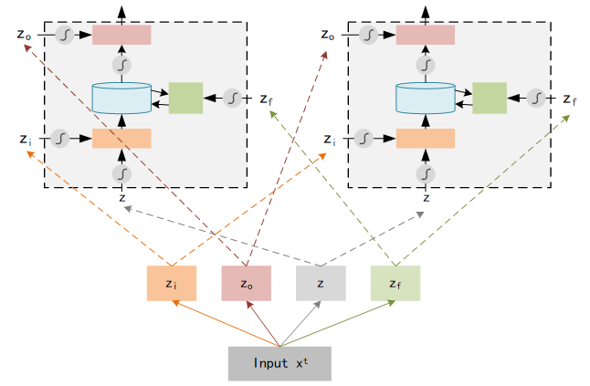

Furthermore, we compute the output using 4 inputs in each neural :

$$
y^t = h[f(z_f)·c_{t-1} + f(z_i)·z]·f(z_o)
$$

Picture below shows the computation logic :

 
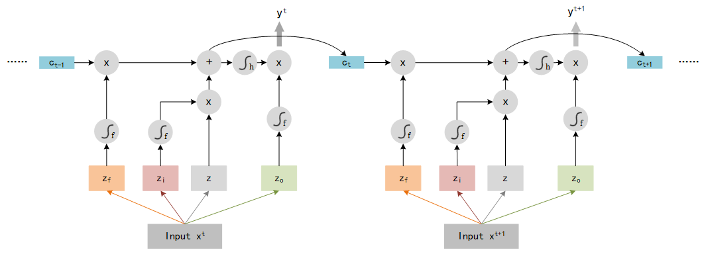

That is not the end of LSTM, we need to add some extra data as input. LSTM use the output $y^t$ and the  memory $c_t$ as the input of next step $t+1$, so the entire structure of LSTM should look like:

 
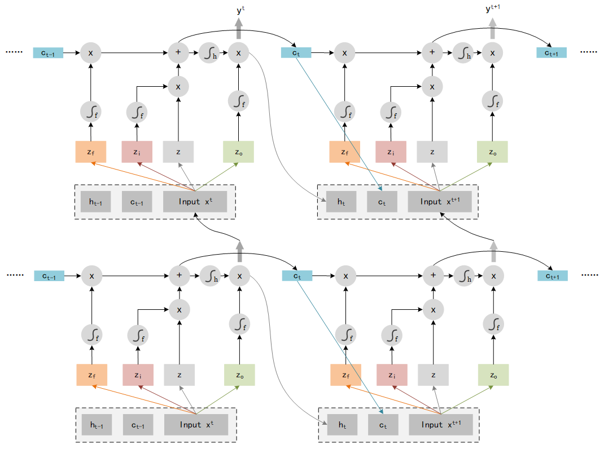

