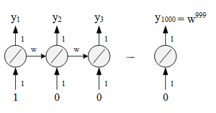

## Recurrent Neural Network

#### Feature of RNN

Differ from normal Neural Network, Recurrent Neural Network has memory. RNN can remember the history, named *hidden state*, and combine it with current state to choose the action $a$. 

<div align=center></div>
Show as above, $x_1$ and $x_2$ are tow inputs, outputs of each hidden layer will be stored in the Network after be calculated. In the next iteration, with another two inputs $x_1'$ and  $x_2'$ ,  network will combine this new inputs {$x_1' $, $x_2'$ } with last outputs history {$a_1$ , $a_2$ }, and compute the final value $y$. In particular, $a_1$ and $a_2$ are history data, could be explained as memory, so we can say that RNN has ability to remember history states.<br>Here is an example to understand the RNN: assume all weights in network is 1, no bias and all activation functions are linear. We input a sequence : [1, 1], [1, 1], [2, 2], ... and see the result of output. 

* At first we need to initialize the value of memory block, here we set 0 for all block. With [1, 1] input, hidden layer 1 will compute : $x_1$ (1) + $x_2$ (1) + $a_1$ (0) = 2. Same as other neural: 

<div align=center></div>
* When the first iteration finished, memory block will update its value to the output of hidden neural. Now we input the second tuple in the sequence : [1, 1], the output should be :  $x_1$ (1) + $x_2$ (1) + $a_1$ (2) = 4.

<div align=center></div>
`Note` : Change the sequence order will change the output.<br>

So the total work flow of RNN looks like:

<div align=center></div>
<br>

#### Different forms of RNN

RNN has a lot of different types, here introduce three of most common methods: Elman Network,  Jordan Network and Bidirectional RNN.

##### Elman Network and Jordan Network

 <div align=center></div>
The main difference of these two method is : Elman Network stores all parameters of *hidden layers*, use last parameters to compute the value; Jordan Network stores the *target output* value, and combined this output with next input to compute the value.

##### Bidirectional RNN

Bidirectional RNN is train both Forward and Backward model, use the combination of both model to decide the result of $x^t$, shown as below :

 <div align=center></div>
The advantage of this model is that it will decide the value of $x^t$ according to the **entire state** not only the history state (in forward rnn, value of $x^t$ is only decided by the state history before $t$ while there exists backward model in bidirectional rnn which can consider the history between $t$ to $N$, $N$ is the final state of this sequence).

##### ★ Long Short-term Memory (LSTM)

LSTM focus on the structure of Memory cell, which contains three parts in the controller of memory cell: Input Gate, Output Gate and Forget Gate. <br>

* **Input Gate**: memory cell stores the parameters to remember the history, Input Gate decides if these parameters update or not in each step. New parameters of current step can pass into memory cell only if Input Gate is open while the state of Input Gate is controlled by Control Signal.  

* **Output Gate**: output of this model is the parameters in the memory cell, Output Gate which controlled by Output Gate Signal decides these parameters can output or not.
* **Forget Gate**: memory cell stores a lot of history states, which means there may exist some old and outdated data. Forget Gate controlled by Forget Gate Signal decides which data need to be forgot.

There are 4 inputs (Input Gate Signal, Output Gate Signal, Forget Gate Signal and Input Data) and 1 output in this model, structure shown as below:

 <div align=center></div>
Here we input data as $z$, pass the activate function $g$ and become $g(z)$. Input Gate Signal $z_i$ pass the activate function $f$ and become $f(z_i)$, output of Input Gate is $f(z_i)·g(z)$. $c$ is the origin parameters stored in Memory Cell, $z_f$ is the Forget Gate Signal and the output of Forget Gate is $f(z_f)·c$, which named $c'$. The final output $a$ equals $f(z_0)·h(c')$.<br>

> **Note**: Activation Function $f$ often be *sigmoid function*, output is 0 or 1, which expresses the Gate is opened or not. For Input Gate, If value equals 1, the input $z$ is fully passed through this gate while if value equals 0, none of input $z$ could be passed.

A clear example could be found [here (29:50)](https://www.youtube.com/watch?v=xCGidAeyS4M) :

 <div align=center></div>
Now we know the structure of Memory Cell. In LSTM, each Memory Cell expresses a neural which means each neural needs 4 different inputs. Typically we have only 1 input, but these 4 inputs are all computed from that 1 input ( by multiple different vector ).

 <div align=center></div>
Furthermore, we compute the output using 4 inputs in each neural :

$$
y^t = h[f(z_f)·c_{t-1} + f(z_i)·z]·f(z_o)
$$

Picture below shows the computation logic :

 <div align=center></div>
That is not the end of LSTM, we need to add some extra data as input. LSTM use the output $y^t$ and the  memory $c_t$ as the input of next step $t+1$, so the entire structure of LSTM should look like:

 <div align=center></div>
##### GRU (Gated recurrent unit)

A method based on LSTM, which delete 1 gate (only 2 gates used) but has the same performance as LSTM.

#### How to train RNN?

The method of RNN training is also Backpropagation, but exists slight difference: we need to sum the loss of **all steps**.

 <div align=center></div>
##### Unstable in RNN training

In RNN training, the loss values are often jump sharply, show as below picture:

 <div align=center></div>
What is the reason of this strange problem? Visualize the loss value of $w_1$ and $w_2$, found there exists a sharply changing. When orange point jump from 2 to 3, it will get a big loss.

 <div align=center></div>
The resolution of this problem is **Clipping**: if the loss value is bigger than a *threshold*, then let the loss value equal to this *threshold*.<br>This unstable loss is the feature of RNN, but why? What on earth is the reason which causes this problem? Here is an easy example to show the effect of result $y_t$ by changing the $w$. 

 <div align=center></div>
Assume only one neural in each network, weight is 1, no bias, $w$ is transform weight (parameters in last layer needs multiply $w$ then input into next layer).

> $w=1 \quad \rightarrow \quad y_{1000}=1$<br>$w=1.01 \quad \rightarrow \quad y_{1000}\approx20000$<br>

Even if $w$ changes slightly, the output of last layer $y_{1000}$ changes a lot. This because we multiply $w$ many times which means we magnify the effect of transform weight.

> $w = 0.99 \quad \rightarrow \quad y_{1000} \approx0$<br>$w = 0.01 \quad \rightarrow \quad y_{1000} \approx 0$<br>

Even if two $w$ are total different, the output of last layer is same.

##### Use LSTM to solve problem —— handle gradient vanishing

The difficulty of RNN is that we don't know how to choose a suitable learning rate: big $\eta$ need for plane surface but small $\eta$ for sharp changing area. LSTM could solve this problem by making those plane area more uneven so that you can safely assign a small $\eta$.

> In traditional RNN, parameters in memory cell will be covered after each step which means it forget the history before. But in LSTM, parameters in memory cell not be covered, data in this step are added with history before, so the history could be remembered.  Further more, gradient won't be vanished if forget gate is not opened, so there is no gradient vanishing in LSTM.


#### Implementation LSTM with keras

To use keras, we need to understand following terms:

* input_dim: dimension of input vector.
* time_steps: length of Sequence.
* output_dim = dimension of output. Notice this output is **not** the final output of entire Neural Network, it's just the output of LSTM Layers ( LSTM might be a part of one Neural Network, see as code below ).

Say if we want to predict the "happy feeling" or "sad feeling" of two sentence, "I am lucky!" and "I feel bad!". Then the *time_steps* should be 3 ( the length of sentence is 3 ), and the *output_dim* should be 1 ( 0 expresses unhappy while 1 expresses happy ). Because of the different length of words ( 'I' has 1 character while 'lucky' has 5 characters ), we can't choose a fixed input dimension. The resolution of this problem is using **Embedding Layer** to map the different length words to a specific dimension.<br>

##### LSTM for Constant Length Input problem

Here is a simple example which use LSTM to predict the MNIST problem, key code block shown as below:

```python
input_dim = 28  # MNIST image's width
time_steps = 28  # MNIST image's height
output_dim = 28  # output dimension for LSTM
model = Sequential()
model.add(LSTM(units=ouput_dim, input_shape=(time_steps, input_dim))) # add LSTM Layer
model.add(Dense(10, activation='softmax'))  # since there are 10 classes in MNIST
```

##### LSTM for Different Length Input problem

Because of the different length between different sentences. We need to add a *Masking Layer* to solve the Length Problem. <br>First, we add 0 to make all samples have the same length, for example, here is a sample set:

```python
X = np.array([
    [1, 3, 2], # sentence 1 - 3 words
	[2],       # sentence 2 - 1 words
    [3, 4]     # sentence 3 - 2 words
])
```

we use inner function of keras to change the sample length:

```python
X = keras.preprocessing.sequence.pad_sequences(X, maxlen=3, padding='post')
```

Now the matrix X changes to:

```python
array([
    [1, 3, 2], # sentence 1 - 3 words
    [2, 0, 0], # sentence 2 - 3 words
    [3, 4, 0]  # sentence 3 - 3 words
])
```

Then, we add a *Mask Layer* to filter the 0 value which means these neural with 0 value won't be calculated in the feed-forward process.

```python
model = Sequential()
model.add(Masking(mask_value=0, input_shape=(3, 3))) # add Masking Layer
model.add(LSTM(units=ouput_dim, input_shape=(3, 3))) # add LSTM Layer
model.add(Dense(10, activation='softmax')) 
```